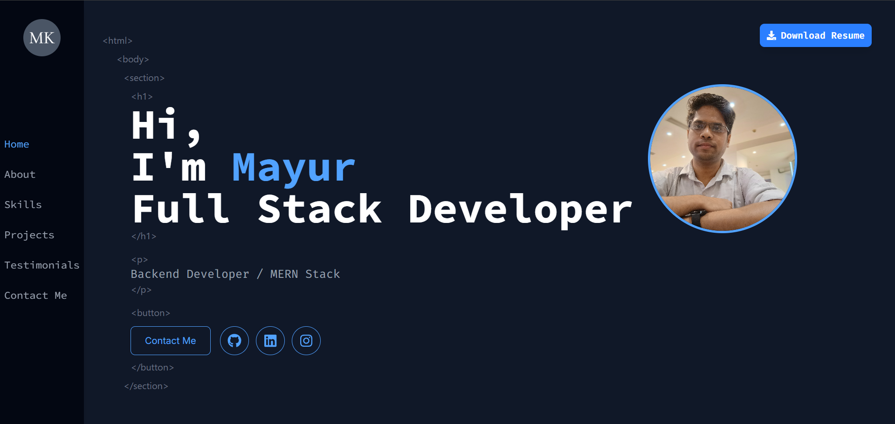

# Portfolio Web Application



A modern, responsive portfolio website built with React, Vite, and Tailwind CSS. This portfolio showcases my projects, skills, and professional experience with a clean, interactive design.

## 🌟 Features

- **Responsive Design**: Fully responsive layout that works on all devices
- **Modern UI**: Clean and professional interface with smooth animations
- **Interactive Elements**: Engaging user experience with Framer Motion animations
- **Dark Theme**: Sleek dark mode design for better readability
- **Contact Form**: Integrated email functionality using EmailJS
- **Project Showcase**: Highlighted portfolio projects with links to live demos and repositories
- **Skills Section**: Visual representation of technical skills
- **Testimonials**: Client and colleague feedback section
- **Resume Download**: Easy access to download resume

## 🚀 Technologies Used

- **React 19**: Modern UI library for building interactive interfaces
- **Vite**: Next-generation frontend tooling for faster development
- **Tailwind CSS 4**: Utility-first CSS framework for rapid UI development
- **Framer Motion**: Animation library for React
- **React Router**: For seamless navigation
- **EmailJS**: For contact form functionality
- **React Icons**: For beautiful icon integration
- **Styled Components**: For component-specific styling
- **Flowbite**: UI component library based on Tailwind CSS

## 📋 Prerequisites

- Node.js (version 18.0.0 or higher)
- npm or yarn

## 🛠️ Installation

1. Clone the repository:
   ```bash
   git clone https://github.com/mayurk224/my_portfolio
   cd my_portfolio
   ```

2. Install dependencies:
   ```bash
   npm install
   # or
   yarn
   ```

3. Start the development server:
   ```bash
   npm run dev
   # or
   yarn dev
   ```

4. Open your browser and navigate to `http://localhost:5173`

## 🔧 Configuration

### Customizing Content

All personal information and content can be modified in the `src/data/data.js` file:

- Personal details
- Skills
- Projects
- Testimonials
- Contact information

### Styling

The project uses Tailwind CSS for styling. You can customize the theme in:

- `src/index.css` - For global styles and font imports
- Component-specific styling within each component file

## 📦 Building for Production

To create a production build:

```bash
npm run build
# or
yarn build
```

The build artifacts will be stored in the `dist/` directory.

## 🚢 Deployment

This project is configured for easy deployment on Vercel with the included `vercel.json` configuration file.

### Deploying to Vercel

1. Push your code to a GitHub repository
2. Import the project in Vercel
3. Deploy


### 💡 Inspiration
The design of this portfolio was inspired by the incredible work of [Tarane Yarahmadi](https://dribbble.com/shots/22427081-Portfolio-Website
) on Dribbble. Huge thanks for the creative UI/UX inspiration!


## 📞 Contact

Mayur Kamble - [mayurkamble0250@gmail.com](mailto:mayurkamble0250@gmail.com)

Project Link: [https://github.com/mayurk224/my_portfolio](https://github.com/mayurk224/my_portfolio)


